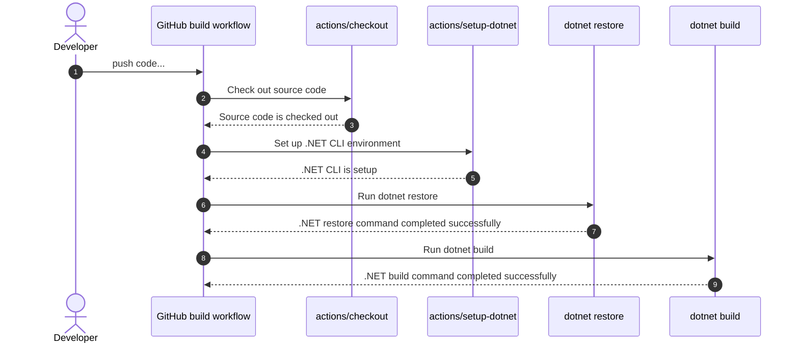

# .NET 💜 GitHub Actions

The purpose of this repository is to demonstrate the ease-of-use with GitHub Actions.

## Build and deploy status badges 📛

### Build workflow sequence diagram

## Demo app 🔗

**[Let's Learn GitHub Actions](https://aka.ms/lets-learn-github-actions)**
